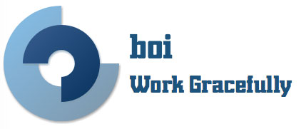

<div align=center>



[](https://github.com/boijs/boi/blob/master/LICENSE)
[](https://www.npmjs.com/package/boi)

Frontend development tool chains for gracefull workflow.
</div>

## Installation
```bash
npm install boi -g
```

## Introduction
### Official site
[Boi - Work Gracefully](https://boijs.github.io/)

### Documentation
[Documentation](https://boijs.github.io/docs)

### Features
* [Scaffold](https://boijs.github.io/docs/#/_scaffold)
* [Webpack based build system](https://boijs.github.io/docs/#/_build)
  * [ECMAScript](https://boijs.github.io/docs/#/_config-js)
  * [CSS pre-processor](https://boijs.github.io/docs/#/_config-style)
  * [Autoprefixer](https://boijs.github.io/docs/#/_config-style)
  * [Auto generate CSS Sprites](https://boijs.github.io/docs/#/_config-style)
  * [Server Side Render](https://boijs.github.io/docs/#/_config-html)
  * [Image compresstion & Base64](https://boijs.github.io/docs/#/_config-image)
  * [Multipage webapp](https://boijs.github.io/docs/#/_multipage)
* [DevServer](https://boijs.github.io/docs/#/_devserver)
  * [HMR](https://boijs.github.io/docs/#/_devserver)
  * [Livereload](https://boijs.github.io/docs/#/_devserver)
* [Mock Server](https://boijs.github.io/docs/#/_mock)
  * [Boi integration](https://boijs.github.io/docs/#/_mock)
  * [Node.js integration](https://boijs.github.io/docs/#/_mock)
* [Deployment](https://boijs.github.io/docs/#/_deploy)
* [Multiple Execution Environment](https://boijs.github.io/docs/#/_envs)
* [Extensible](https://boijs.github.io/docs/#/_advance)
  * [Boi plugins](https://boijs.github.io/docs/#/_advance-plugin)
  * [Generator tempalte](https://boijs.github.io/docs/#/_advance-scaffold)


## Usage
Create new project:
```bash
boi new webapp -t <template>
```

> use [boiapp](https://github.com/boijs/generator-boiapp) template by default

Run dev server:
```bash
boi serve
```

> You will need to add `-i` option when you first run dev server or build/compile,[click here to get more infomation]()

Build/Compile the project:
```bash
boi build -e <env>
```
or
```bash
boi compile -e <env>
```

> `<env>` would be 'testing' if not be specified,[click here to get more infomation](https://boijs.github.io/docs/#/_build).

Deploy your project to remote server which support SFTP protocol:
```
boi deploy -e <env>
```
or
```
boi release -e <env>
```

## Authors
* **zhoujunpeng**

## License

[MIT License](./LICENSE)

Copyright (c) 2016 boijs

Permission is hereby granted, free of charge, to any person obtaining a copy
of this software and associated documentation files (the "Software"), to deal
in the Software without restriction, including without limitation the rights
to use, copy, modify, merge, publish, distribute, sublicense, and/or sell
copies of the Software, and to permit persons to whom the Software is
furnished to do so, subject to the following conditions:

The above copyright notice and this permission notice shall be included in all
copies or substantial portions of the Software.

THE SOFTWARE IS PROVIDED "AS IS", WITHOUT WARRANTY OF ANY KIND, EXPRESS OR
IMPLIED, INCLUDING BUT NOT LIMITED TO THE WARRANTIES OF MERCHANTABILITY,
FITNESS FOR A PARTICULAR PURPOSE AND NONINFRINGEMENT. IN NO EVENT SHALL THE
AUTHORS OR COPYRIGHT HOLDERS BE LIABLE FOR ANY CLAIM, DAMAGES OR OTHER
LIABILITY, WHETHER IN AN ACTION OF CONTRACT, TORT OR OTHERWISE, ARISING FROM,
OUT OF OR IN CONNECTION WITH THE SOFTWARE OR THE USE OR OTHER DEALINGS IN THE
SOFTWARE.
