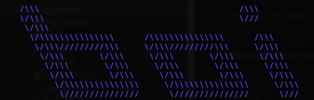
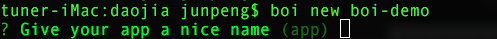
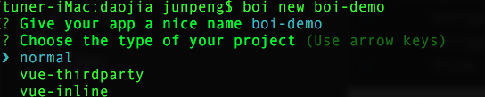
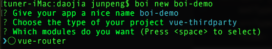
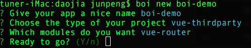
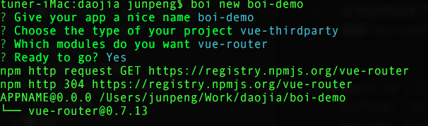
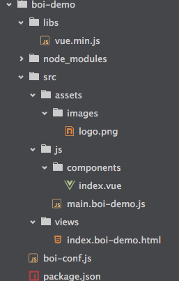
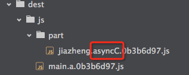
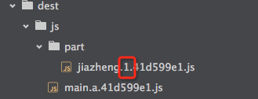
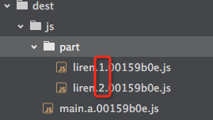

# Boi-cli
boi is short for bolshoi

基于webpack的前端工程构建工具。



  * [Get Start](#get-start)
    * [安装](#安装)
    * [创建boi项目](#创建boi项目)
    * [编译项目文件](#编译项目文件)
    * [使用插件](#使用插件)
    * [dev server](#dev-server)
  * [规范(v1.0.0)](#规范(v1-0-0))
    * [目录规范](#目录规范)
    * [命名规范](#命名规范)
      * [JS文件命名规范](#js文件命名规范)
      * [style文件命名规范](#style文件命名规范)
      * [html模板文件命名规范](#html模板文件命名规范)
    * [编码规范](#编码规范)
      * [资源引用规范](#资源引用规范)
      * [模块化开发规范](#模块化开发规范)
  * [配置API](#配置api)
    * [spec配置项](#spec配置项)
      * [basic](#basic)
      * [js](#js)
      * [style](#style)
      * [html](#html)
      * [image](#image)
    * [serve配置项](#serve配置项)
  * [插件](#插件)
    * [使用插件](#使用插件)
    * [安装插件](#安装插件)


## Get Start

### 安装

```
npm install boi-cli -g
```

### 创建boi项目

boi安装成功后，在工作目录内运行：

```
boi new boi-demo
```

或者在已存在目录下运行：

```
boi new .
```

命令行将依次有以下提示：



自定义项目名称，默认项目名称为app。



选择项目类型，上图中依次为常规项目、vue作为第三方库单独引入的项目和vue参与webpack打包的项目。

> 常规项目不限制任何选型，开发者可以自由使用第三方库的引入方式（script标签、npm等）。同时，常规项目的boi-conf.js只有最基本的配置，也就是说，如果在常规项目中使用vue，开发者需自行进行配置。



选择npm第三方依赖。



最终确认。



配置完毕后，boi会自动安装npm第三方依赖。全部执行成功后，生成的项目目录如下图：



### 编译项目文件

1.	在项目根目录下创建文件`boi-conf.js`;
2.	编辑`boi-conf.js`中的配置项，比如js文件的编译配置如下：

```
boi.spec('js', {
    extType: 'js',
    srcType: ['es2015'],
    srcDir: 'js',
    destDir: 'js'
});
```

在项目根目录下执行`boi build`。默认是dev环境的编译，会生成souremap文件以方便debug。

生产环境的编译执行：

```
boi build prod
```

prod环境编译输出的文件不会产生souremap。

### 使用插件

编辑`boi-conf.js`，使用API `boi.use`引入插件，比如：

```
boi.use('boi-plugin-loader-vue');
```

boi会判断用户是否已安装此插件，如果没有，则boi会自动安装此插件。

> 建议自行安装插件，boi使用npm安装插件，由于一些*原因*可能会安装失败

如果npm被墙，请尝试以下*任意*一种方案：

1.	挂VPN；
2.	修改npm仓库到淘宝镜像`npm config set registry https://registry.npm.taobao.org`;
3.	安装cnpm。

> 如果安装cnpm，请务必自行安装插件

### dev server

项目根目录下执行：

```
boi serve
```

执行成功后访问`localhost:8888/*.html`或者`localhost:8888/views/*.html`(html文件根据具体命名改动)。boi支持动态编译，开发过程中不必多次重启dev server。


## 规范(v1.0.0)

boi框架约定了一套默认开发规范（可配置），包括目录规范、文件命名规范和部分编码规范。

> 目前v1.0.0规范比较宽松，后续版本会制定详细约束。

### 目录规范

-	开发源码目录： `src`

	1.	JS源码目录： `src/js`;
	2.	style源码目录： `src/style`;
	3.	html模板源码目录： `src/views`;
	4.	媒体资源原始文件目录： `src/assets`。

-	第三方库文件目录：`libs`

	> boi不支持非npm管理的第三方库文件打包。此类库文件应该是多项目共用的，建议使用固定CDN地址引用。

-	本地编译输出目录： `dest`

### 命名规范

目前(v1.0.0)规范中只约定了入口文件的命名规范，子文件暂时不做约束。

所有文件遵循以下规范：

-	不论是否在相同子目录内，同类型文件**一定不能重名**，否则会编译出错；
-	源码中引用其他文件使用相对目录。

#### JS文件命名规范

-	存放目录：`src/js`;
-	入口文件以`main`为命名前缀。比如`main.app.js`；
-	子文件**一定不要**以`main`为命名前缀。

#### style文件命名规范

-	存放目录：`src/style`;
-	入口文件以`main`为命名前缀。比如`main.app.scss`；
-	子文件**一定不要**以`main`为命名前缀。

#### html模板文件命名规范

-	存放目录：`src/views`;
-	以`index`为命名前缀。比如`main.app.html`；

### 编码规范

#### 资源引用规范

-	由于webpack不支持style文件作为编译入口，所以style文件必须借助JS文件引入。比如`main.app.js`中引入`main.app.scss`语法如下：

	```
	import '../style/main.app.scss';
	```

-	html模板引用JS、style文件时，只需写文件名即可，**不能写任何与路径相关的字符**，否则会编译出错。如下：

	```
	<script src="main.suyun.comment.js"></script>
	```

	编译后的结果如下：

	```
	<script src="/js/main.suyun.comment.fb74692f.js"></script>
	```

-	html模板引用第三方库文件使用绝对路径。如下：

	```
	<script src="/libs/vue.min.js" charset="utf-8"></script>
	```

	> boi不对第三方库文件进行编译，上述的引用建议只在本地开发中使用，真实上线文件请使用公司通用的第三方库文件url。

#### 模块化开发规范

目前v1.0.0版本支持CommonJS和AMD规范，两者在*load on demand*模块的打包中有细微差别。

-	CommonJS

	CommonJS使用`require.ensure`实现load on demand，如下：

	```
	import a from './part/part.a.js';
	import b from './part/part.b.js';
	window.onload = function() {
	    console.log('main chunk a is loaded');
	    a();
	    b();
	    document.body.onclick = function() {
	        // 第三个参数是chunk name，决定编译打包的文件名称
	        require.ensure([], (require) => {
	            let c = require('./part/part.c');
	            c.fn();
	        }, 'asyncC');
	    }
	};
	```

	`require.ensure`的**第三个参数必须指定**，这个参数影响打包输出的文件名称。上述文件打包后输出结果如下：

	

	红框处即`require.ensure`的第三个参数值，如果不指定此参数，编译后的结果为：

	

-	AMD

	以实现AMD规范的require.js为例，其实现load on demand的语法如下：

	```
	import '../styles/main.a.scss';
	// ADM sample
	require(['./part/part.a.js', './part/part.b.js'], function(a, b) {
	    console.log('main chunk a is loaded');
	    a();
	    b();
	    document.body.onclick = function() {
	        require(['./part/part.c.js'], function(c) {
	            c();
	        });
	    }
	});
	```

	AMD规范无法配置load on demand模块的文件文件名，输出的编译文件如下：

	

	> webpack虽然提供配置输出chunk文件名的API，但是AMD规范目前无法实现，也可能是本人未研究透彻，希望各位指正。


## 配置API

boi配置文件位于项目根目录，文件名为`boi-conf.js`。

目前v1.0.0支持的可配置项有：

`spec`配置项是编译项目的配置，包括以下几种：
-	`basic`：`Object`，基础配置；
-	`js`：`Object`，JS文件的编译配置项；
-	`style`：`Object`，style文件的编译配置项；
-	`html`：`Object`，html模板文件的编译配置项；
-	`image`：`Object`，图片文件的编译配置项。

`serve`配置项是dev server的配置，包括以下几种：
* `port`：`String`，修改默认监听端口；
* `domain`：`String`，修改默认监听域名

> 目前版本支持的配置项较少，以满足本公司需求为主，后续版本会扩充可配置模块。

### spec配置项

#### basic

-	`appName`：`String`，项目名称，默认值为`app`；
-	`localPath`: `Object`，本地目录配置；
	1.	`src`：`String`，源码文件目录；
	2.	`dest`：`String`，编译输出的本地目录；
	3.	`thirdparty`：本地第三方库文件目录。 -
-	`cdn`：【选填】`Object`，cdn相关配置；
	1.	`server`：`String`，cdn域名；
	2.	`path`：`String`，项目在cdn服务器的路径。 -

#### js

-	`extType`：`String`，扩展名，默认值为js；
-	`srcType`：`Array`，源文件的转译配置，默认值为`['es2015']`；
-	`srcDir`：`String`，JS文件源码存放目录，相对于`basic.localPath.src`；
-	`destDir`：`String`，JS文件编译输出目录，相对于`basic.localPath.dest`；
-	`mainFilePrefix`：`String`，JS入口文件的命名前缀，默认值为`main`；
-	`uglify`：`Boolean`，编译输出文件是否uglify，默认`true`；
-	`useHash`：`Boolean`，编译输出文件是否打上hash指纹，默认`true`；
-	`mutiEntriesVendor`：`Boolean`，存在多入口文件时是否提取公共部分作为一个独立文件，默认值为`false`。此配置项在未指定`vendor`时才会起效，如果未指定`vendor`并且存在多个入口文件，可以将公用的webpack runtime提取出来，已减少主文件体积并利用浏览器缓存提升应用性能；
-	`files`:【选填】`Object`，指定编译文件。此项如不开启则boi自动匹配遵循命名规范的入口文件。

	1.	`main`：`Object`，指定入口文件，如下：

		```
		files: {
		    main: {
		        'a': 'main.a.js',
		        'main.b': 'main.b.js'
		    }
		}
		```

	2.	`vendor`：`Array`，通用模块列表，数组内的模块将被合成打包为`vendor.js`。

-	`webpackConfig`：`Object`，boi支持自定义webpack的module和plugins配置项，此项配置将完全覆盖boi内置的webpack配置，请谨慎使用。

	1.	`preloader`：`Object`；
	2.	`loader`：`Object`；
	3.	`postLoader`：`Object`；
	4.	`plugins`：`Array`。

#### style

style配置项与JS大体相同，有以下区别：

-	没有`uglify`、`srcType`、`mutiEntriesVendor`和`files`配置项；
-	`extType`决定css预编译器的选型。

#### html

html配置项与JS大体相同，有以下区别：

-	html没有`uglify`、`srcType`、`mutiEntriesVendor`和`useHash`配置项；
-	`files`: `Array`，index文件的列表，仍需遵循命名规范；
-	`mainFilePrefix`：默认值为`'index'`。

#### image

-	`extType`：`Array`，图片文件扩展名列表；
-	`destDir`：`String`，编译输出目录，`basic.localPath.dest`；
-	`base64`：`Boolean`，是否对小尺寸图片进行base64编码，默认`false`；
-	`base64Limit`：`Number`，base64编码文件的体积上限，大于这个尺寸的文件不会被base64编码；
-	`cdn`：【选填】`String`，图片可配置独立的cdn域名，此项配置将覆盖basic同名配置项。比如style文件中引用图片：`
	body{
	    background-color:blue;
	    backgournd: url('../assets/images/icons.png');
	}
	`

	image配置项为：

	```
	boi.spec('image', {
	    extType: ['png', 'jpg'],
	    destDir: 'image',
	    cdn: 'img.daojia.com',
	});
	```

	编译输出的文件为：

	```
	body{
	    background-color:blue;
	    backgournd:url(http://img.daojia.com/icons.b709986b.png)
	}
	```

### serve配置项

* `port`：`String`，修改默认监听端口；
* `domain`：`String`，修改默认监听域名


## 插件

boi的核心功能比较轻量，具体的功能由boi插件完成。

### 使用插件

使用插件API为`boi.use`，修改`boi-conf.js`配置文件如下：

```
boi.use('boi-plugin-loader-vue');
```

boi本身不支持特定框架的编译，vue编译以及dev server配置由[boi-plugin-loader-vue](http://git.djcorp.cn/djfe/boi-plugin-loader-vue)插件提供。

具体示例请参考[demo](http://git.djcorp.cn/djfe/boi-example/tree/master/app/suyun)。

### 安装插件

boi插件可以自行安装：

```
npm install boi-plugin-loader-vue --save-dev
```

由于某些不可言表的原因，npm可能会安装失败，请尝试以下解决方法：

1.	挂VPN；
2.	将npm仓库地址修改为taobao镜像：

	```
	npm config set registry https://registry.npm.taobao.org/
	```

3.	使用[cnpm](https://github.com/cnpm/cnpm)安装。

如果用户不自行安装，boi会**自动**安装所使用的插件。

> 推荐使用npm自行安装，cnpm安装目前存在一些不可预估的问题，后续会修复。

